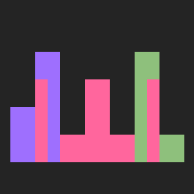
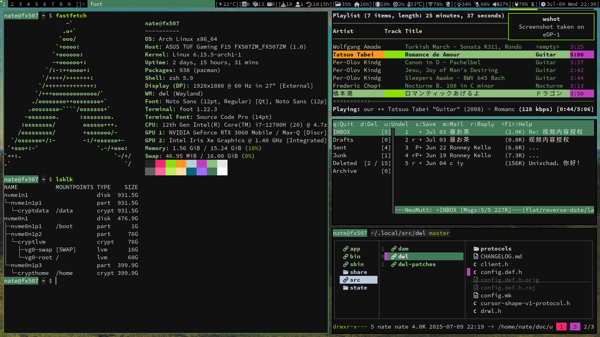

#  My build of [dwl](https://codeberg.org/dwl/dwl) - dwm for Wayland




### Running dwl
```sh
alias dl="exec ssh-agent ${HOME}/.local/bin/damblocks | /usr/local/bin/dwl"
```

### Status information
I'm using the bar patch with `damblocks`([codeberg](https://codeberg.org/unixchad/damblocks)/[github](https://github.com/gnuunixchad/damblocks)), my modular POSIX script with signaling support.

For a build without the `bar.patch`, checkout the `nobar` branch. You can use any compatible bar.

### Patches applied
1. [bar](https://codeberg.org/dwl/dwl-patches/patch/bar)
2. [autostart](https://codeberg.org/dwl/dwl-patches/patch/autostart)
3. [sticky](https://codeberg.org/dwl/dwl-patches/patch/sticky)
4. [swapandfocusdir](https://codeberg.org/dwl/dwl-patches/patch/swapandfocusdir)
5. [bottomstack](https://codeberg.org/dwl/dwl-patches/patch/bottomstack)
6. [shiftview](https://codeberg.org/dwl/dwl-patches/patch/shiftview)(Modifed for bar-0.7.patch)
7. [pertag](https://codeberg.org/dwl/dwl-patches/patch/pertag)(Modifed for bar-0.7.patch)

#### Changes I've made to [bar](https://codeberg.org/dwl/dwl-patches/patch/bar) patch:
- Reduce `lfpad` to 0.75, for paddings around tag names(commit f31b82b9db279c6f20689586e7ee1bc2615e2c11).
- Draw bar status on unfocused outputs, unlike the default `dwm` bar(commit 1a9dcebcee0b99c725fe4acfa1c7968f4cf7cbd4).

patch involes manual patch for some other patches, due to the changes:
```diff
--- TAGSCOUNT
+++ LENGTH(tags)
```


### Building dwl v0.7
dwl has the following dependencies:
- libinput
- wayland
- wlroots0.18 (compiled with the libinput backend)
- xkbcommon
- wayland-protocols (compile-time only)
- pkg-config (compile-time only)

dwl has the following additional dependencies if XWayland support is enabled:
- libxcb
- libxcb-wm
- wlroots0.18 (compiled with X11 support)
- Xwayland (runtime only)

To enable XWayland, you should uncomment its flags in `config.mk`.
