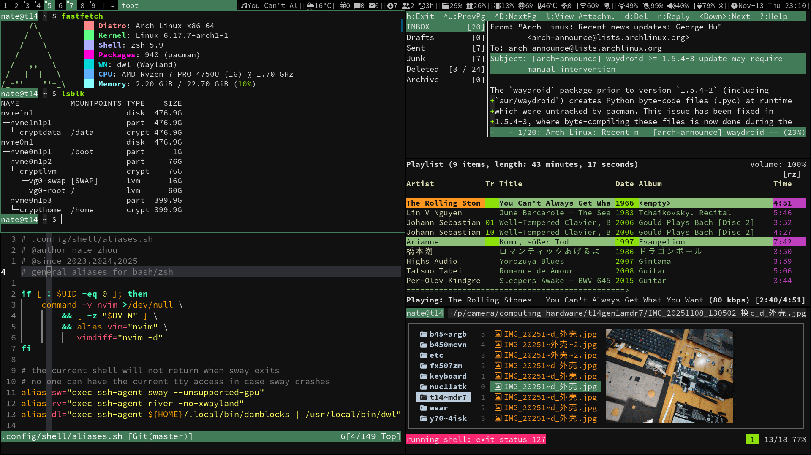

#  My build of [dwl](https://codeberg.org/dwl/dwl) - dwm for Wayland



dwl 0.9-dev

### Status bar
I'm using the bar patch with `damblocks`([codeberg](https://codeberg.org/unixchad/damblocks)/[github](https://github.com/gnuunixchad/damblocks)), my modular POSIX script with signaling support.

### Running dwl
```sh
exec ssh-agent damblocks | dwl
```

To restart status script in the current dwl session, start dwl with:
```sh
damblocks --fifo &
exec ssh-agent tail -f ${XDG_RUNTIME_DIR}/damblocks.fifo | dwl
```
and restart damblocks with:
```sh
pkill -f 'damblocks --fifo'
nohup damblocks --fifo >/dev/null 2>&1 &
```

### Patches applied
1. [bar](https://codeberg.org/dwl/dwl-patches/patch/bar)
2. [autostart](https://codeberg.org/dwl/dwl-patches/patch/autostart)
3. [sticky](https://codeberg.org/dwl/dwl-patches/patch/sticky)
4. [shifttag-bar](https://codeberg.org/dwl/dwl-patches/src/branch/main/patches/shifttag)
5. [pertag](https://codeberg.org/dwl/dwl-patches/patch/pertag)
6. [swapandfocusdir](https://codeberg.org/dwl/dwl-patches/patch/swapandfocusdir)
7. [genericgaps](https://codeberg.org/dwl/dwl-patches/patch/genericgaps)
8. [alwayscenter](https://codeberg.org/dwl/dwl-patches/patch/alwayscenter)
9. [text-input](./patches/text-input)
10. [bottomstack](https://codeberg.org/dwl/dwl-patches/patch/bottomstack)
11. [decklayout](https://codeberg.org/dwl/dwl-patches/patch/decklayout)
12. [gaplessgrid](https://codeberg.org/dwl/dwl-patches/patch/gaplessgrid)
13. [bar-less-padding](./patches/bar-less-padding)
14. [bar-statusallmons](./patches/bar-statusallmons)
15. [modes](https://codeberg.org/dwl/dwl-patches/patch/modes)
16. [bar-modes](https://codeberg.org/dwl/dwl-patches/patch/bar-modes)
17. [moveresizekb](https://codeberg.org/dwl/dwl-patches/patch/moveresizekb)
18. [unclutter](https://codeberg.org/dwl/dwl-patches/patch/unclutter)
19. [hide-cursor-when-typing](https://codeberg.org/dwl/dwl-patches/patch/hide-cursor-when-typing)


### known issues
- footclient window flickering, see [dwl#705](https://codeberg.org/dwl/dwl/issues/705)


### Building dwl
dwl has the following dependencies:
- libinput
- wayland
- wlroots0.20 (compiled with the libinput backend)
- xkbcommon
- wayland-protocols (compile-time only)
- pkg-config (compile-time only)

dwl has the following additional dependencies if XWayland support is enabled:
- libxcb
- libxcb-wm
- wlroots (compiled with X11 support)
- Xwayland (runtime only)

Install these (and their `-devel` versions if your distro has separate
development packages) and run `make`. If you wish to build against a released
version of wlroots (*you probably do*), use a [release] or a [0.x branch]. If
you want to use the unstable development `main` branch, you need to use the git
version of [wlroots].

To enable XWayland, you should uncomment its flags in `config.mk`.
